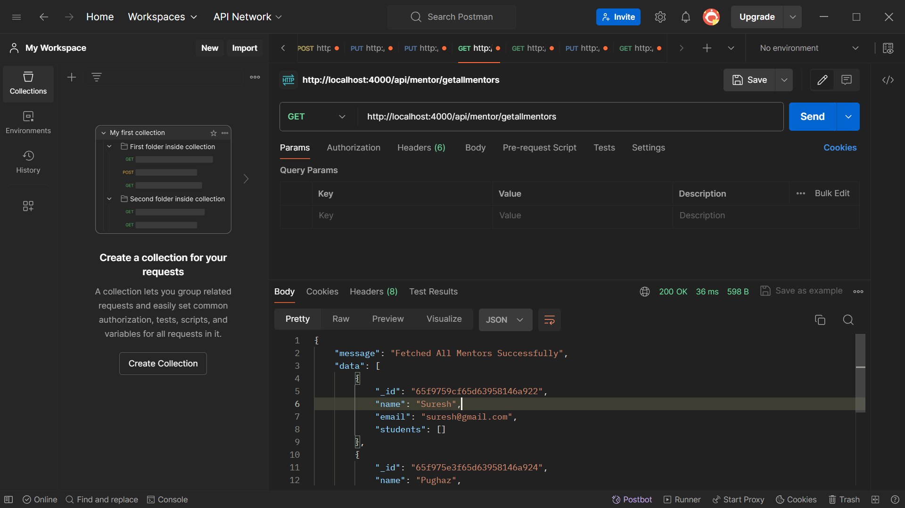
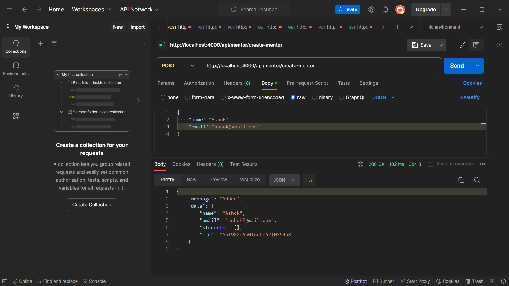
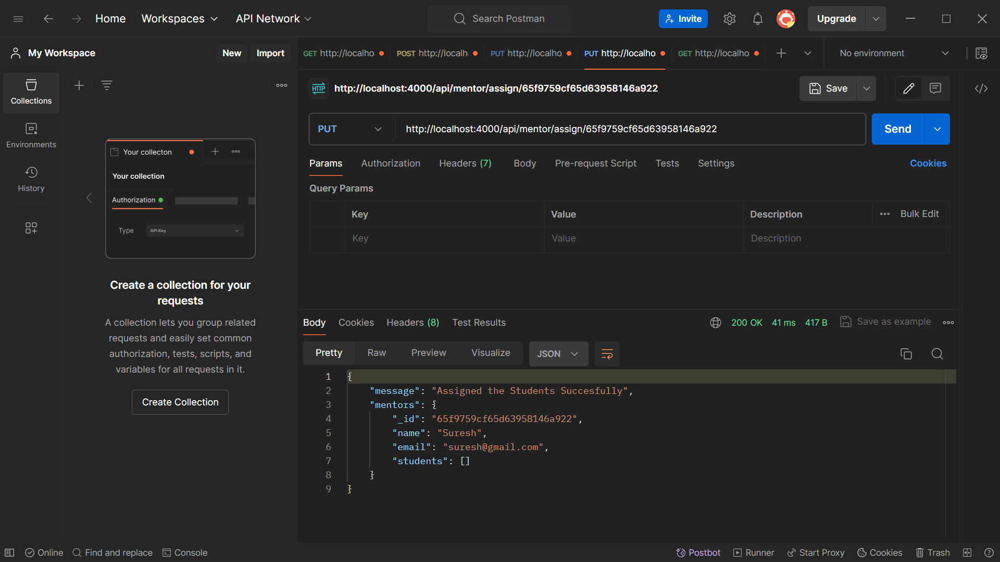
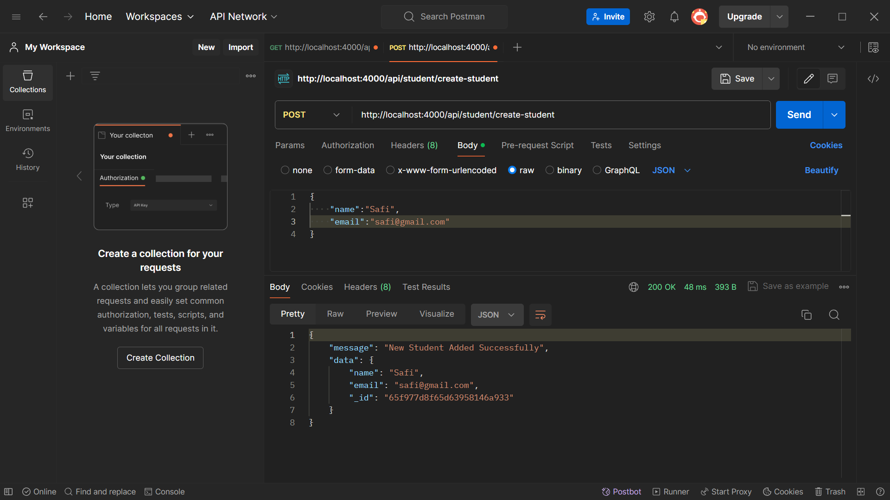
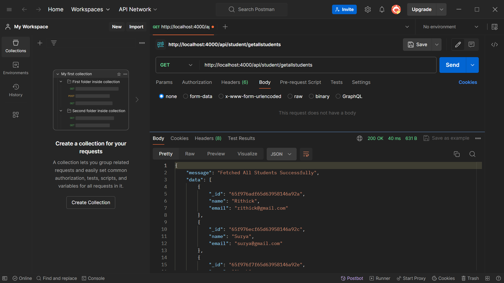
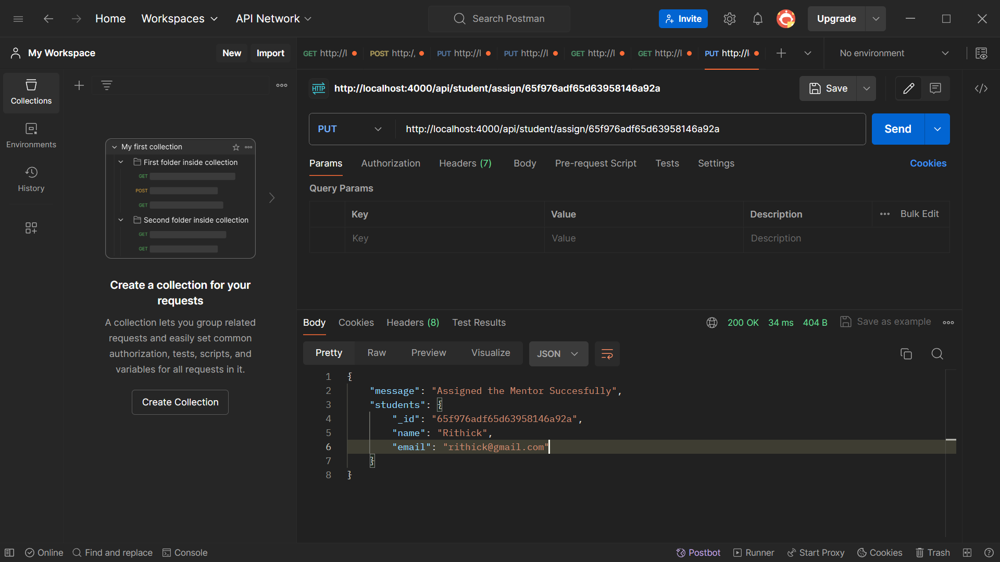

# GET http://localhost:4000/api/mentor/getallmentors
## Description: Retrieves all mentors

# GET http://localhost:4000/api/mentor/create-mentor
## Description: Create a new mentor

# GET http://localhost:4000/api/mentor/mentor-student/:id
## Description: Assign mentor to students

# GET http://localhost:4000/api/student/create-student
## Description: Create a new student

# GET http://localhost:4000/api/student/getallstudents
## Description: Retrieves all students

# GET http://localhost:4000/api/student/assign/:id
## Description: Assign students to mentor

